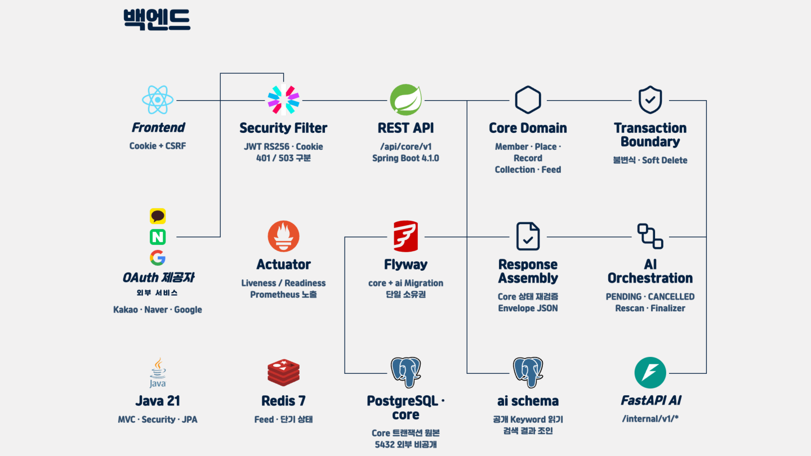

# PinLog Backend

PinLog 백엔드 애플리케이션입니다. Spring Boot와 Java 21을 기반으로 하며, 로컬 개발 인프라는 Docker Compose로 실행합니다.

## 시스템 아키텍처



### 요청/인증 경계

모든 API는 애플리케이션이 소유하는 `/api/core` context path로 들어옵니다. Spring Security 필터 체인은 Actuator·인증 진입점 등 명시된 공개 경로만 허용하고 나머지는 인증을 요구하며, Access JWT 쿠키를 `MemberPrincipal`로 변환합니다. 쿠키 기반 인증의 상태 변경 요청은 CSRF 검증을 거치고, 도메인 서비스에는 `SecurityContext` 대신 해석된 `memberId`만 전달합니다.

### Core 도메인·트랜잭션

`member`, `place`, `record`, `collection`, `follow`, `feed`, `search`는 controller → service → repository의 세로 슬라이스로 구성됩니다. 서비스가 트랜잭션 경계를 소유하고 JPA의 Open EntityManager in View는 끄며, PostgreSQL의 `core` 스키마를 도메인 데이터의 원본으로 사용합니다.

### AI 비동기 처리·Scheduler

Context 변경은 Core 트랜잭션 커밋 뒤 `@TransactionalEventListener(AFTER_COMMIT)`와 전용 executor를 통해 FastAPI 처리 요청으로 전달됩니다. 유실되거나 정지된 작업은 `AiRescanScheduler`가 `fixedDelay`로 재스캔하며, 후보 잠금·재시도 상태 커밋과 외부 HTTP 호출을 분리해 DB 잠금을 호출 대기 동안 유지하지 않습니다.

### PostgreSQL core/ai·Flyway와 Redis

하나의 pgvector PostgreSQL에서 `core`와 `ai` 스키마를 분리하고, Hibernate는 스키마를 생성하지 않고 `validate`만 수행합니다. Flyway는 공통 기반 `V1`, Backend `V2`~`V99`, AI `V100`~`V199`의 소유 구간으로 마이그레이션하며, Redis는 Refresh 토큰 회전·폐기 등 세션 상태와 캐시를 담당합니다.

### Actuator startup/liveness/readiness/metrics

Actuator의 전체 health는 startup probe에, `/actuator/health/liveness`는 프로세스 생존 판정에, `/actuator/health/readiness`는 트래픽 수신 판정에 사용합니다. readiness에는 애플리케이션 상태와 DB를 포함하되 Redis는 제외하고, liveness에는 외부 의존성을 넣지 않습니다. Prometheus는 `/actuator/prometheus`에서 Micrometer 메트릭을 수집하며 모든 경로 앞에는 `/api/core`가 붙습니다.

## 기여와 개발 규칙

시작 절차, Jira 중심 작업 추적, 검증과 PR 규칙의 단일 원본은 [CONTRIBUTING.md](./CONTRIBUTING.md)입니다. API, DB, 테스트의 상세 기준은 [개발 규약](./docs/development/)에서 확인합니다.

## 기술 스택

- Java 21
- Spring Boot 4.1.0
- Gradle 9.5.1 (Gradle Wrapper)
- Spring Web MVC
- Spring Data JPA
- Spring Data Redis
- Spring Boot Actuator / Micrometer Prometheus
- PostgreSQL
- Redis
- Lombok
- JUnit 6

## 사전 준비

- JDK 21
- Docker Desktop or Docker Engine with Docker Compose

## 로컬 인프라

[`compose.yaml`](./compose.yaml)은 다음 서비스를 구성합니다.

| 서비스 | 이미지 | 로컬 포트 | 개발용 설정 |
| --- | --- | --- | --- |
| PostgreSQL | `pgvector/pgvector:0.8.1-pg16` | `15432` | DB/사용자 `pinlog`, 비밀번호는 `.env`에서 관리 |
| Redis | `redis:7.4.5-alpine` | `16379` | 컨테이너 포트 `6379` |

기본 실행은 다음 한 가지 흐름을 사용합니다.

```bash
cp .env.example .env
docker compose up -d --wait
docker compose ps
./gradlew bootRun
```

Windows에서는 `./gradlew` 대신 `.\gradlew.bat`를 사용합니다.

`docker compose down`은 서비스를 중지하고, 데이터 볼륨은 유지합니다.

```bash
docker compose down
```

로컬 PostgreSQL 데이터를 초기화해야 할 때만 다음 명령을 사용합니다. 이 명령은 `postgres-data` 볼륨을 삭제합니다.

```bash
docker compose down -v
```

Compose 서비스의 포트와 PostgreSQL 계정은 `.env.example`에 정의되어 있습니다. `.env`는 각 개발자의 로컬 환경 파일이며 커밋하지 않습니다.

Spring Boot Docker Compose 지원이 포함되어 있어 애플리케이션을 개발 모드로 실행하면 Compose 서비스 연결 정보를 자동으로 감지합니다.

> 현재 Compose 계정과 비밀번호는 로컬 개발 전용입니다. 배포 환경에서는 환경 변수나 별도의 시크릿 저장소로 분리해야 합니다.

서비스가 `/api/core` 경로 prefix를 직접 소유하므로 기본 애플리케이션 주소는
`http://localhost:8080/api/core`입니다. 컨트롤러에는 `/api/core`를 다시 붙이지 않습니다.

## 모니터링 및 헬스체크

백엔드는 Actuator와 Micrometer를 통해 상태 및 Prometheus 형식의 메트릭을 제공합니다.

| 용도 | URI |
| --- | --- |
| 전체 상태 | `http://localhost:8080/api/core/actuator/health` |
| Liveness | `http://localhost:8080/api/core/actuator/health/liveness` |
| Readiness | `http://localhost:8080/api/core/actuator/health/readiness` |
| Prometheus 메트릭 | `http://localhost:8080/api/core/actuator/prometheus` |

모니터링 데이터는 다음 흐름으로 전달됩니다.

```text
Backend Actuator → Prometheus 수집 → Grafana 시각화
```

백엔드는 위 엔드포인트를 제공하고 정상 응답을 보장합니다. Kubernetes probe 연결,
Prometheus 수집, Grafana 대시보드 및 외부 접근 제한은 인프라에서 구성합니다.

현재 health와 Prometheus 엔드포인트는 인프라 구성요소가 인증 없이 호출할 수 있도록
애플리케이션에서 허용되어 있습니다. 운영 Ingress와 NetworkPolicy에서는 Actuator 경로를
필요한 내부 구성요소에만 노출해야 합니다.

운영 환경의 기본 probe 경로는 `/api/core/actuator/health`이며, 세부 probe를 분리한다면
`/api/core/actuator/health/liveness`와 `/api/core/actuator/health/readiness`를 사용합니다.

## 컨테이너 이미지

**`Dockerfile`은 미리 빌드된 jar를 받습니다. `./gradlew bootJar`가 선행입니다.** 컨테이너 안에서 Gradle을 돌리지 않으므로, jar 없이 `docker build`만 실행하면 실패합니다.

```powershell
./gradlew bootJar
docker build --build-arg BUILD_SHA=sha-local -t pinlog-back:local .
```

CI도 같은 방식입니다 — `backend-ci`가 러너에서 `./gradlew check bootJar`로 만든 jar를 이미지 빌드에 넘깁니다. 컨테이너 안에서 다시 컴파일하면 같은 코드를 두 번 빌드하게 되고, 그 구간은 레이어 캐시로도 지울 수 없어 없앴습니다([BD-44](docs/backend/decisions/BD-44-image-takes-prebuilt-jar.md)).

빌드 컨텍스트는 `.dockerignore`가 `build/libs/*.jar` 하나만 남깁니다.

컨테이너는 클러스터 보안 규약에 맞춰 UID 1000 비루트 사용자로 실행됩니다.

## 테스트

완료 전 공통 검증은 다음 명령입니다. 테스트는 Testcontainers로 `pgvector/pgvector:0.8.1-pg16` PostgreSQL 컨테이너를 실행하므로 Docker Desktop or Docker Engine with Docker Compose가 실행 중이어야 합니다.

```bash
./gradlew clean check --no-daemon
```

단위 또는 특정 테스트만 실행할 때는 아래 명령을 사용합니다.

Windows:

```powershell
.\gradlew.bat test
```

macOS/Linux:

```bash
./gradlew test
```

테스트 결과 보고서는 `build/reports/tests/test/index.html`에서 확인할 수 있습니다.

## 프로젝트 구조

```text
pinlog-back/
├── src/
│   ├── main/
│   │   ├── java/com/pinlog/pinlogback/
│   │   └── resources/application.yml
│   └── test/
├── build.gradle
├── compose.yaml
├── Dockerfile
├── .dockerignore
├── gradlew
├── gradlew.bat
└── settings.gradle
```

## 설계·구현 문서

백엔드 설계·구현 문서는 [`docs/`](./docs)에서 관리합니다. 공통 개발 규약은 아래에서, AI 연동 문서는 `docs/ai/`에서 확인합니다.

- [`docs/development/`](./docs/development/) — 워크플로우, 코드 리뷰, 패키지 구조, API, 에러 처리, 로깅, 설정, 데이터베이스, 테스트 상세 규약
- [`docs/ai/`](./docs/ai) — FastAPI 연동, Context AI State 동기화, 재스캔 Scheduler, 삭제·취소 처리, Keyword 응답 조립
- Feed 문서는 [`docs/ai/spec/`](./docs/ai/spec)에 포함되어 있습니다.

전체 목록과 구성은 [`docs/README.md`](./docs/README.md)를 참고합니다. AI 공용 계약은 Team-PinLog/docs의 `static/05_AI_설계.md`가 단일 원본입니다.

## 설정 참고

- Java toolchain은 21로 고정되어 있습니다.
- Gradle은 시스템 Gradle 대신 저장소에 포함된 Wrapper를 사용합니다.
- PostgreSQL과 Redis는 로컬 개발용 Docker Compose 서비스입니다.
- 통합 테스트는 Testcontainers의 PostgreSQL(pgvector)에서 Flyway 마이그레이션을 검증합니다.
- 운영 ingress 경로와 애플리케이션 context path는 모두 `/api/core`로 맞춰야 합니다.
- 운영 health probe 경로는 `/api/core/actuator/health`입니다.
- 환경별 설정과 실제 인증정보는 저장소에 직접 커밋하지 않습니다.
