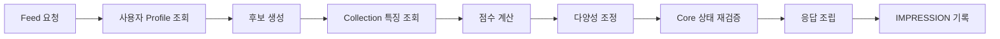

# Feed 추천 파이프라인

> 현재 코드가 없는 구현 예정 명세입니다.
> 공용 계약은 Team-PinLog/docs의 `static/05_AI_설계.md`를 따릅니다.

## 1. 범위

Feed 추천의 전체 구조와 각 단계의 책임을 정의합니다. 점수 공식과 가중치는 [`feed-scoring.md`](feed-scoring.md), Cache는 [`feed-profile-cache.md`](feed-profile-cache.md), 이벤트 수집은 [`feed-event.md`](feed-event.md)에서 다룹니다.

Feed의 추천 단위는 **Collection**입니다. Record가 아닙니다.

## 2. 경계 — Spring 단독

Feed는 Spring Backend의 기능입니다. **Feed 요청 처리 중 다음을 호출하지 않습니다.**

- FastAPI의 어떤 API도 호출하지 않습니다.
- Embedding API를 호출하지 않습니다.
- LLM API를 호출하지 않습니다.
- 요청 시점에 벡터 유사도를 계산하지 않습니다.

Feed는 **이미 저장된 AI 파생 데이터와 Cache만** 사용합니다. MVP에서는
`ai.context_keyword`와 `ai.keyword_preset`을 읽기 조인하며 Place region·category는 사용하지 않습니다.

이 경계를 두는 이유:

- Feed는 사용자 요청 경로이며 응답 지연이 곧 체감 품질입니다. 외부 모델 호출은 지연과 비용이 예측 불가능합니다.
- AI 장애가 Feed를 중단시키지 않아야 합니다. AI는 기본 기능의 부가 계층입니다.
- Keyword가 아직 없는 Collection도 Feed에 노출될 수 있어야 합니다.

FastAPI는 Feed API를 제공하지 않고 Feed 점수를 계산하지 않습니다.

## 3. 파이프라인



### 3.1 사용자 Profile 조회

로그인 User의 관심 Profile을 Redis에서 조회합니다. 없으면 DB에서 계산해 채웁니다.

Profile 구성:

- 본인의 `PUBLIC` Keyword 분포
- 본인의 `PRIVATE_ONLY` Keyword 분포
- 팔로우 중인 `followee_member_id` 집합

`PRIVATE_ONLY`는 여기에만 쓰입니다. 타인 Collection의 특징 계산에는 절대 사용하지 않습니다. `BLOCKED`는 Profile 계산에서도 제외합니다.

### 3.2 후보 생성

여러 채널에서 Collection id를 모아 합집합을 만들고 중복을 제거합니다. 목표 후보 풀은 약 200건입니다.

- 최신 발행 Collection
- 팔로우한 Shelf의 Collection
- 탐색용 무작위 Collection

이 단계는 **id만** 다룹니다. 본문이나 특징을 함께 조회하지 않습니다. 채널별 쿼리와 배분은 [`feed-scoring.md`](feed-scoring.md)를 참조합니다.

최신 발행 채널의 배분을 60에서 100으로 올린 것은 P42에서 Place region 항이 빠지면서 AI 미완료 Collection이 점수를 얻던 경로가 사라진 데 대한 **부분적 보상**입니다. 후보 진입 기회만 넓힐 뿐 점수 열세는 해소하지 않습니다. 근거는 [`feed-scoring.md`](feed-scoring.md) 2.1에 있습니다.

본인 Collection과 이미 팔로우 관계가 아닌 탈퇴 User의 Collection은 후보에서 제외합니다.

### 3.3 Collection 특징 조회

후보 id 목록으로 각 Collection의 특징을 **일괄** 조회합니다. Collection별 반복 조회를 하지 않습니다.

타인 Collection의 특징으로 사용할 수 있는 것은 다음뿐입니다.

- `PUBLIC` Keyword
- `record_count`
- `published_at`

`PRIVATE_ONLY`와 `BLOCKED`는 이 쿼리의 WHERE 절에서 제외합니다. 자바 코드에서 거르지 않습니다.

특징은 Redis에 캐시합니다. Cache miss인 id만 모아 한 번의 DB 쿼리로 채웁니다.

### 3.4 점수 계산

Profile과 Collection 특징을 조합해 점수를 계산합니다. 전부 메모리 내 산술이며 DB나 외부 호출이 없습니다.

### 3.5 다양성 조정

점수 순 상위만 뽑으면 같은 소유자·같은 지역이 몰립니다. 소유자 단위 상한과 탐색 슬롯을 적용해 조정합니다.

### 3.6 Core 상태 재검증

응답 직전에 최종 선정된 Collection에 대해서만 Core 상태를 다시 확인합니다. Cache가 stale일 수 있기 때문이며, 이 단계가 삭제된 데이터 노출을 막는 마지막 방어선입니다.

```text
member.deleted_at IS NULL
collection.deleted_at IS NULL
collection.is_published = true
collection.record_count > 0
```

탈락한 항목은 조용히 제외합니다. 부족분을 다음 후보로 채우려면 점수 정렬 결과에서 이어받되, 재검증을 다시 통과해야 합니다.

### 3.7 응답 조립

공개용 DTO만 사용합니다. Context 본문과 `member.id`를 포함하지 않습니다. Feed는 타인 데이터 접근 경로이므로 단일 공개 조회 서비스를 거칩니다.

Keyword가 없는 Collection은 빈 배열로 응답합니다. 오류가 아닙니다.

### 3.8 IMPRESSION 기록

응답으로 내보낸 항목을 `core.feed_event`에 IMPRESSION으로 기록합니다. 이 기록이 다음 요청의 노출 패널티 근거가 됩니다.

## 4. API

```text
GET  /api/core/v1/feed/collections?cursor={opaqueCursor}&size=20
POST /api/core/v1/feed/events
```

- 한 페이지는 기본 20건입니다. `size`는 공통 커서 계약을 그대로 따릅니다 — 기본값 `CursorPage.DEFAULT_SIZE`(20), 서버 방어 상한 `CursorPage.MAX_SIZE`(100), 범위 밖 값은 `CursorPage.normalizeSize`가 보정합니다. Feed 전용 상한을 따로 두지 않습니다(S15P11A705-117이 세운 "서버 방어 상한의 답은 하나" 규약).
- `requestId`는 Feed Session 식별자이며 응답 본문과 CLICK·SAVE 이벤트 payload의 별도 필드입니다.
- `cursor`는 내부 구조를 노출하지 않는 opaque 문자열입니다. 서버는 cursor로 같은 Session의 다음 위치를 복원해 페이지 간 중복·누락을 방지합니다.
- 후보 풀 자체는 Session 단위로 Redis에 짧게 보관합니다. 매 페이지마다 후보를 다시 생성하면 정렬이 흔들립니다.
- Collection 상세는 Feed 전용 URL을 만들지 않고 공통 `GET /api/core/v1/collections/{collectionId}`를 재사용합니다.
- AI 처리가 끝나지 않은 Collection도 후보에 포함하며 응답에는 `keywords: []`를 넣습니다.
- `POST /api/core/v1/feed/events`는 클라이언트가 CLICK·SAVE를 보고하는 엔드포인트입니다. 상세는 [`feed-event.md`](feed-event.md)를 참조합니다.

## 5. 실패 처리

| 상황 | 동작 |
|---|---|
| Redis 장애 | Cache 미사용으로 폴백해 DB에서 직접 계산. 응답은 정상 |
| Profile 계산 실패 | Cold Start 경로로 폴백 (인기·최신 위주) |
| 후보 0건 | 최신 발행 Collection만으로 응답. 빈 배열도 허용 |
| Keyword 없음 | 해당 항목의 keyword affinity를 0으로 두고 계속 진행 |
| IMPRESSION 기록 실패 | 로그만 남기고 응답은 정상 반환 |

Feed는 어떤 경우에도 AI나 Cache 때문에 500을 내지 않습니다.

## 6. 하지 않는 것

- 학습형 Ranking 모델을 두지 않습니다.
- Multi-Armed Bandit을 도입하지 않습니다.
- Collection Keyword를 물리 집계 테이블로 만들지 않습니다. 조인 집계와 Cache로 처리합니다.
- Feed 결과를 사용자별로 사전 생성(precompute)하지 않습니다. 요청 시점 계산입니다.
- 후보 생성에 벡터 검색을 쓰지 않습니다.
