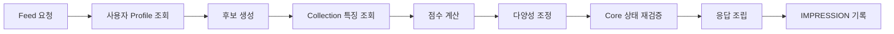

# Feed 추천 파이프라인

> 현재 코드가 없는 구현 예정 명세입니다.
> 공용 계약은 Team-PinLog/docs의 `static/05_AI_설계.md`를 따릅니다.

## 1. 범위

Feed 추천의 전체 구조와 각 단계의 책임을 정의합니다. 점수 공식과 가중치는 [`feed-scoring.md`](feed-scoring.md), Cache는 [`feed-profile-cache.md`](feed-profile-cache.md), 이벤트 수집은 [`feed-event.md`](feed-event.md)에서 다룹니다.

Feed의 추천 단위는 **Collection**입니다. Record가 아닙니다.

## 2. 경계 — Spring 단독

Feed는 Spring Backend의 기능입니다. **Feed 요청 처리 중 다음을 호출하지 않습니다.**

- FastAPI의 어떤 API도 호출하지 않습니다.
- Embedding API를 호출하지 않습니다.
- LLM API를 호출하지 않습니다.
- 요청 시점에 벡터 유사도를 계산하지 않습니다.

Feed는 **이미 저장된 AI 파생 데이터와 Cache만** 사용합니다. MVP에서는
`ai.context_keyword`와 `ai.keyword_preset`을 읽기 조인하며 Place region·category는 사용하지 않습니다.

이 경계를 두는 이유:

- Feed는 사용자 요청 경로이며 응답 지연이 곧 체감 품질입니다. 외부 모델 호출은 지연과 비용이 예측 불가능합니다.
- AI 장애가 Feed를 중단시키지 않아야 합니다. AI는 기본 기능의 부가 계층입니다.
- Keyword가 아직 없는 Collection도 Feed에 노출될 수 있어야 합니다.

FastAPI는 Feed API를 제공하지 않고 Feed 점수를 계산하지 않습니다.

## 3. 파이프라인



### 3.1 사용자 Profile 조회

로그인 User의 관심 Profile을 Redis에서 조회합니다. 없으면 DB에서 계산해 채웁니다.

Profile 구성:

- 본인의 `PUBLIC` Keyword 분포
- 본인의 `PRIVATE_ONLY` Keyword 분포
- 팔로우 중인 `followee_member_id` 집합

`PRIVATE_ONLY`는 여기에만 쓰입니다. 타인 Collection의 특징 계산에는 절대 사용하지 않습니다. `BLOCKED`는 Profile 계산에서도 제외합니다.

### 3.2 후보 생성

여러 채널에서 Collection id를 모아 합집합을 만들고 중복을 제거합니다. 목표 후보 풀은 약 200건입니다.

- 최신 발행 Collection
- 팔로우한 Shelf의 Collection
- 탐색용 무작위 Collection

이 단계는 **id만** 다룹니다. 본문이나 특징을 함께 조회하지 않습니다. 채널별 쿼리와 배분은 [`feed-scoring.md`](feed-scoring.md)를 참조합니다.

최신 발행 채널의 배분을 60에서 100으로 올린 것은 P42에서 Place region 항이 빠지면서 AI 미완료 Collection이 점수를 얻던 경로가 사라진 데 대한 **부분적 보상**입니다. 후보 진입 기회만 넓힐 뿐 점수 열세는 해소하지 않습니다. 근거는 [`feed-scoring.md`](feed-scoring.md) 2.1에 있습니다.

본인 Collection과 이미 팔로우 관계가 아닌 탈퇴 User의 Collection은 후보에서 제외합니다.

### 3.3 Collection 특징 조회

후보 id 목록으로 각 Collection의 특징을 **일괄** 조회합니다. Collection별 반복 조회를 하지 않습니다.

타인 Collection의 특징으로 사용할 수 있는 것은 다음뿐입니다.

- `PUBLIC` Keyword
- `record_count`
- `published_at`

`PRIVATE_ONLY`와 `BLOCKED`는 이 쿼리의 WHERE 절에서 제외합니다. 자바 코드에서 거르지 않습니다.

특징은 Redis에 캐시합니다. Cache miss인 id만 모아 한 번의 DB 쿼리로 채웁니다.

### 3.4 점수 계산

Profile과 Collection 특징을 조합해 점수를 계산합니다. 전부 메모리 내 산술이며 DB나 외부 호출이 없습니다.

### 3.5 다양성 조정

점수 순 상위만 뽑으면 같은 소유자·같은 지역이 몰립니다. 소유자 단위 상한과 탐색 슬롯을 적용해 조정합니다.

### 3.6 Core 상태 재검증

응답 직전에 최종 선정된 Collection에 대해서만 Core 상태를 다시 확인합니다. Cache가 stale일 수 있기 때문이며, 이 단계가 삭제된 데이터 노출을 막는 마지막 방어선입니다.

```text
member.deleted_at IS NULL
collection.deleted_at IS NULL
collection.is_published = true
collection.record_count > 0
```

탈락한 항목은 조용히 제외합니다. 부족분을 다음 후보로 채우려면 점수 정렬 결과에서 이어받되, 재검증을 다시 통과해야 합니다.

### 3.7 응답 조립

공개용 DTO만 사용합니다. Context 본문과 `member.id`를 포함하지 않습니다. Feed는 타인 데이터 접근 경로이므로 단일 공개 조회 서비스를 거칩니다.

Keyword가 없는 Collection은 빈 배열로 응답합니다. 오류가 아닙니다.

#### 3.7.1 표시 Keyword의 선정과 정렬

응답 `keywords`는 **최대 4개**입니다. 근거와 기각한 대안은 [P46](../proposals/P46-feed-keyword-display-order.md)에 있습니다.

**정렬 키는 사전식으로 셋이며 셋 다 결정적입니다.**

| 순위 | 키 | 방향 | 뜻 |
|---|---|---|---|
| 1 | 축 내 순위 | 오름차순 | 같은 `keyword_preset.category` 안에서 (빈도 내림차순, `preset.id` 오름차순)으로 매긴 1-based 순위 |
| 2 | 빈도 | 내림차순 | 그 Collection 안에서 해당 Keyword가 붙은 Context 수 |
| 3 | `keyword_preset.id` | 오름차순 | UNIQUE 정수. 여기서 전순서가 완성됩니다 |

이 순서로 정렬한 뒤 앞에서 4개를 자릅니다. **선정 순서가 곧 표시 순서입니다** — 고른 뒤 다시 정렬하지 않습니다.

축 1순위는 라운드로빈 효과를 냅니다. 각 축의 최상위가 모두 「축 내 순위 1」이므로 상위 4칸이 서로 다른 축으로 먼저 채워지고, 축이 4개 미만인 Collection은 남는 칸을 「축 내 순위 2」 이하로 채웁니다. **축이 하나뿐이어도 4칸이 찹니다.**

**왜 이 기준인가 — 요지 넷.** (전체 근거는 P46)

- **Collection 내재 기준입니다.** 추천 점수의 `keywordAffinity`는 보는 사람 기준(요청자 Profile과의 weighted Jaccard)이므로 표시에 쓰지 않습니다. 쓰면 같은 Collection이 보는 사람마다 다른 Keyword를 보여주고, `collection_id`로 잡힌 특징 Cache를 표시에 재사용할 수 없으며, **남의 카드에 내 Profile이 비칩니다.**
- **빈도만으로는 못 자릅니다.** 실측에서 Collection의 63%가 모든 Keyword의 빈도가 1이고, 자를 필요가 있는 6건 중 4건이 여기 해당합니다.
- **축이 개수 4의 근거입니다.** 프리셋은 `COMPANION`(누구와)·`ACTIVITY`(무엇을)·`ATMOSPHERE`(어떤 분위기)·`SITUATION`(어떤 상황) 네 축입니다. 한 칸씩 채우면 카드가 한 문장으로 읽힙니다. **프리셋의 축이 늘거나 줄면 이 수도 함께 움직입니다** — 그때 프론트 레이아웃과 함께 다시 정합니다.
- **동점은 표시값이 아니라 `preset.id`로 풉니다.** 표시값은 언제든 바뀌므로 라벨을 고친 순간 카드 구성이 바뀝니다(`S15P11A705-252`가 같은 이유로 점수 계산의 키를 `code`로 못 박았습니다). `id`는 축 블록(1xx~4xx)이 들어 있어 동점일 때 축 순서로 정렬됩니다.

**개수는 설정값이 아니라 상수입니다.** 프론트가 이 수로 레이아웃을 확정하므로 배포마다 달라지면 계약이 아닙니다. [`feed-scoring.md`](feed-scoring.md)의 튜닝값과는 다른 층입니다 — 그쪽은 응답 계약에 드러나지 않는 내부 랭킹 거동입니다.

**경계 동작.**

| 상황 | 동작 |
|---|---|
| Keyword 0개 | `[]`. 오류가 아닙니다(공용 §16 시나리오 21) |
| Keyword 4개 미만 | 있는 만큼. 실측 25%가 이 경로이며 정상 경로입니다 |
| 표시값을 못 찾은 `code`(폐기·비공개 전환) | 그 항목만 빠지고 **다음 후보가 그 자리를 채웁니다**. `code`로 대신 채우지 않습니다(08 §6.1) |
| 서로 다른 `code`의 표시값이 겹침 | 앞의 것만 남기고 **다음 후보가 그 자리를 채웁니다**. 4칸을 비우지 않습니다 |

**감수하는 것.** 축 분산이 1순위이므로 더 높은 빈도가 뒤로 밀릴 수 있습니다. 한 축이 빈도 5·4를 가지고 다른 축이 1을 가지면 순서는 `[5, 1, 4]`입니다. 규칙의 의도이며 결함이 아닙니다.

**정본.** 개수 상한과 "순서는 항상 같다"는 클라이언트가 보는 응답 계약이므로 공용 `static/08_API_명세.md` §10.1이 정본입니다(05 §14.6이 외부 API 정본을 08로 위임). 정렬 키와 근거는 이 문서와 P46이 담습니다.

> **[명세 갱신 필요]** 08 §10.1에 개수 상한 4와 순서 결정성이 아직 없습니다. `docs`는 별도 레포라 이 저장소의 변경으로 반영할 수 없습니다 — 후속으로 남깁니다(P46 「명세 정본」).

### 3.8 IMPRESSION 기록

응답으로 내보낸 항목을 `core.feed_event`에 IMPRESSION으로 기록합니다. 이 기록이 다음 요청의 노출 패널티 근거가 됩니다.

## 4. API

```text
GET  /api/core/v1/feed/collections?cursor={opaqueCursor}&size=20
POST /api/core/v1/feed/events
```

- 한 페이지는 기본 20건입니다. `size`는 공통 커서 계약을 그대로 따릅니다 — 기본값 `CursorPage.DEFAULT_SIZE`(20), 서버 방어 상한 `CursorPage.MAX_SIZE`(100), 범위 밖 값은 `CursorPage.normalizeSize`가 보정합니다. Feed 전용 상한을 따로 두지 않습니다(S15P11A705-117이 세운 "서버 방어 상한의 답은 하나" 규약).
- `requestId`는 Feed Session 식별자이며 응답 본문과 CLICK·SAVE 이벤트 payload의 별도 필드입니다.
- `cursor`는 내부 구조를 노출하지 않는 opaque 문자열입니다. 서버는 cursor로 같은 Session의 다음 위치를 복원해 페이지 간 중복·누락을 방지합니다.
- 후보 풀 자체는 Session 단위로 Redis에 짧게 보관합니다. 매 페이지마다 후보를 다시 생성하면 정렬이 흔들립니다.
- Collection 상세는 Feed 전용 URL을 만들지 않고 공통 `GET /api/core/v1/collections/{collectionId}`를 재사용합니다.
- AI 처리가 끝나지 않은 Collection도 후보에 포함하며 응답에는 `keywords: []`를 넣습니다.
- 항목의 `keywords`는 **최대 4개**이며 순서는 같은 Collection에 대해 항상 같습니다. 선정·정렬 규칙은 3.7.1입니다.
- `POST /api/core/v1/feed/events`는 클라이언트가 CLICK·SAVE를 보고하는 엔드포인트입니다. 상세는 [`feed-event.md`](feed-event.md)를 참조합니다.

## 5. 실패 처리

| 상황 | 동작 |
|---|---|
| Redis 장애 | Cache 미사용으로 폴백해 DB에서 직접 계산. 응답은 정상 |
| Profile 계산 실패 | Cold Start 경로로 폴백 (인기·최신 위주) |
| 후보 0건 | 최신 발행 Collection만으로 응답. 빈 배열도 허용 |
| Keyword 없음 | 해당 항목의 keyword affinity를 0으로 두고 계속 진행 |
| IMPRESSION 기록 실패 | 로그만 남기고 응답은 정상 반환 |

Feed는 어떤 경우에도 AI나 Cache 때문에 500을 내지 않습니다.

## 6. 하지 않는 것

- 학습형 Ranking 모델을 두지 않습니다.
- Multi-Armed Bandit을 도입하지 않습니다.
- Collection Keyword를 물리 집계 테이블로 만들지 않습니다. 조인 집계와 Cache로 처리합니다.
- Feed 결과를 사용자별로 사전 생성(precompute)하지 않습니다. 요청 시점 계산입니다.
- 후보 생성에 벡터 검색을 쓰지 않습니다.
